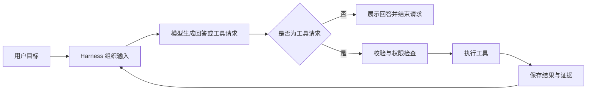

# 01 设计理念：把极简变成可执行的取舍

## 从一个容易误解的公式开始

可以用 `Agent ≈ Model + Harness` 帮助理解分工，但它不是严格的系统定义。模型根据输入生成回答或工具请求；Harness 组织上下文、解释协议、校验请求、取得许可、运行工具，并决定是否进入下一轮。

模型输出“已经修改文件”，不会让磁盘自动变化。只有宿主程序实际调用文件操作，才发生修改。模型输出“测试通过”，也不等于测试真的执行过。这个分界决定了整个架构：自然语言负责表达意图，程序负责控制动作和提供证据。



## 极简的对象是功能面和耦合

如果只写“模型调用 → 执行命令 → 再调用模型”，成功路径确实很短。但当命令一直不退出、用户临时取消、模型参数错误、历史过长时，缺失的控制机制会转化为用户无法理解的失败。

Tiness 的取舍是：保留一个单进程、单消费者的执行主线；不引入扩展平台、长期记忆或旧会话恢复。与此同时，保留权限、预算、取消、上下文和日志，因为这些决定当前任务能否可靠收尾。

| 决策 | 保留什么 | 主动舍弃什么 | 承担的代价 |
|---|---|---|---|
| 固定工具 | read、write、edit、shell、update_plan | 动态工具注册、extension 生命周期 | 新工具需要改代码和测试 |
| 单消费者 | 一次处理一条消息，工具按序执行 | 多任务并行调度 | 吞吐量较低，状态更容易解释 |
| 工作区优先 | 项目配置、任务日志、产物就地保存 | 集中式项目数据库 | 用户自行管理工作区数据 |
| 当前进程状态 | 多条请求连续工作 | 旧 Task 列表、恢复和搜索 | 重启不继续旧上下文 |
| 有界执行 | 轮次、时间、队列和输出上限 | 无限自主运行 | 到达上限可能需要用户缩小任务 |
| 轻量指导 | AGENTS.md 和本地 Skills | 插件平台、自动长期 memory | 指导内容由用户维护 |
| 显式 shell 授权 | 命令确认、超时、进程清理 | 操作系统沙箱 | 获准命令具有宿主用户能力 |

“以后也许要支持”不足以成为本版抽象的理由。比如现在只有一个模型适配实现，可以先定义一个小接口供测试替换，不需要同时建设模型市场和自动路由。

## 先写必须成立的条件

设计时，先问哪些条件一旦被破坏，就不能声称程序还在正常工作：

1. 没有许可的工具不能进入执行阶段。
2. 新消息在前一条完成收尾前不能进入当前上下文。
3. 每个已接收的工具调用都要有结果，包括未执行和无法确认。
4. 取消后必须清理当前操作，才能处理下一条消息。
5. 摘要失败不能覆盖仍有效的历史投影。
6. 日志不可写时不能继续制造无记录的动作。

这些条件会贯穿后面每一个组件。它们比“支持了多少功能”更能解释 Harness 的质量。

## 用代码表达边界

下面是 [模型接口源码节选](../../src/model/types.ts)：

```typescript
export interface ModelAdapter {
  generate(
    input: ModelInput,
    signal: AbortSignal,
    onText?: (text: string) => void
  ): Promise<ModelOutput>
}
```

接口没有 `writeFile` 或 `approve`。它只收输入、支持取消、输出模型结果。执行动作属于另一层。这种“小接口”既方便替换真实模型为 FakeModel，也阻止模型适配层顺手接管权限和工作区状态。

## 不要把设计意图说成硬保证

“复杂任务先计划”“不要绕过工具拒绝”写入了系统指导。这会影响模型行为，但没有变成完整的操作系统安全策略。相反，参数校验、静态 deny、最大轮次等由代码执行，可以直接构造测试验证。

因此要分清三类机制：提示指导、程序约束、外部隔离。Tiness 实现前两类的一部分，没有实现第三类的 shell 沙箱。教学时如实说出边界，才能讨论下一步是否值得增加复杂度。

## 小练习

有人提出增加“跨项目长期记忆”。请写出它需要新增的数据生命周期、读取边界和失效规则，再判断它是否服务于本版“当前工作区内完成当前任务”的目标。合格的分析应说明新增责任，而不是仅回答功能是否有用。

下一章：[架构与一次请求的旅程](02-架构与请求旅程.md)。
