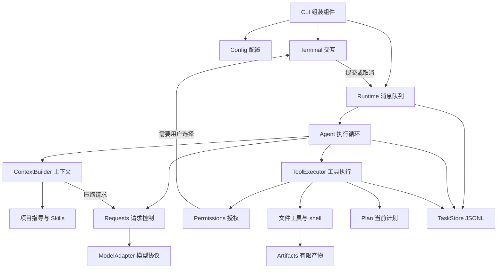
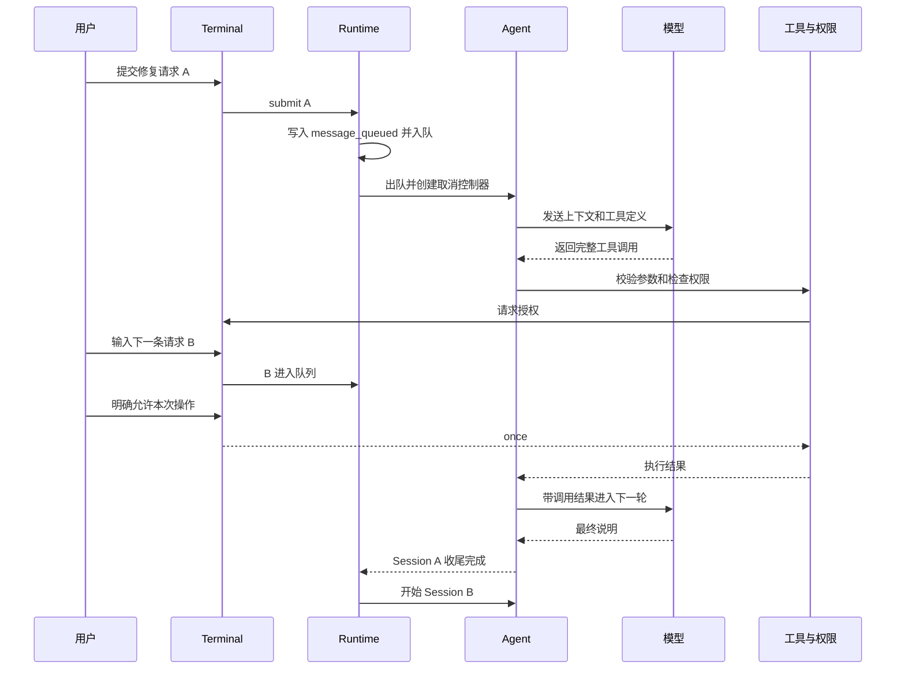

# 02 架构：沿着一次请求理解组件

## 先区分三个生命周期

| 名称 | 在 Tiness 中的含义 | 生命周期内保存什么 |
|---|---|---|
| Task | 启动或空闲时执行 `/new` 创建的工作容器 | 日志文件、上下文投影、产物登记 |
| Session | 一条已出队的用户消息从开始到收尾 | 临时授权、Plan、取消控制器、压缩次数 |
| Round | 一次逻辑模型请求及其完整工具批次 | 模型协议项、工具调用和工具结果 |

网络重试不增加 Round。一个模型响应里的三个工具请求也不等于三个 Round。Session 正常结束或取消后，Task 可以继续处理下一条排队消息，继承先前结果；但不会继承先前 Session 的临时授权。

## 核心组件地图



模块数量并不意味着每个模块都要成为服务。它们在同一进程里协作，小接口使责任可分离，但没有引入网络调用、消息中间件或数据库。

## 一次完整交互



请求 B 到达时不会改变 A 的参数、目标或权限答案。这使“正在做什么”和“接下来做什么”保持可解释。用户要立即停止 A，应按 Esc；提交一条新消息本身不会取消 A。

## 入口只做组装

[CLI 源码节选](../../src/cli.ts)：

```typescript
const config = await loadConfig();
terminal = new Terminal(secrets, config.runtime.queue.maxMessageBytes, config.cwd);
runtime = new Runtime(
  config,
  new OpenAIResponsesAdapter(config.connection),
  terminal,
  n => terminal!.setQueue(n),
  () => { void quit(); }
);
await runtime.init();
terminal.start({
  submit: text => runtime!.submit(text),
  cancel: () => runtime!.cancel(),
  newTask: () => runtime!.newTask(),
  quit
});
```

入口知道“谁接到谁”，但不知道一次 edit 如何提交、摘要怎样生成。否则每新增一个组件，入口都会变成更难测试的总控脚本。

## 三份看起来相似、用途不同的数据

终端消息用于人阅读，可以折叠工具输出；上下文投影用于下一次模型调用，可以压缩旧块；JSONL 用于追溯事件，不因压缩删除原记录。三者共享事实来源，但不应共享一个可随意截断的字符串数组。

这是本项目非常重要的一次取舍：多保留几个明确的数据结构，换取展示、推理输入和记录之间互不破坏。减少结构数量并不总能减少复杂度。

## 小练习

对贯穿案例画出两个 Session 和至少三个 Round。把“读取文件”“审批等待”“网络重试”“更新 Plan”放进对应范围。检查：审批等待应属于某个 Session 的时间预算；排队请求 B 还没有自己的 Session 计时器。

下一章：[配置与工作区边界](03-配置与工作区边界.md)。
