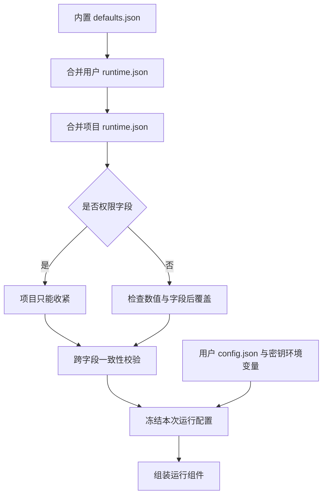

# 03 配置：默认可用，覆盖有边界

## 配置应该回答两个不同的问题

连接配置回答“调用哪个模型、用什么凭据”；运行配置回答“最多运行多久、能做哪些操作、能保留多少输入”。把两者分开，可以让项目收紧行为，而不接触用户级连接信息。

```text
~/.tiness/
  config.json             用户级模型连接
  runtime.json            用户级运行设置
当前工作目录/
  .tiness/
    runtime.json          项目运行覆盖
    tasks/                每个 Task 一个 JSONL
    artifacts/            按 Task 隔离的工具产物
```

项目统一使用 `.tiness`。全局保存跨工作区的连接与个人默认设置，其他数据优先保存在当前工作区。本版没有项目级模型凭据文件，也没有全局历史数据库。



## 权限覆盖不能是普通对象合并

如果全局 `shell=ask`，而仓库能通过本地文件写成 `shell=allow`，下载一个项目就可能改变自己的授权策略。因此权限有明确顺序：`allow < ask < deny`。

[配置源码节选](../../src/config.ts)：

```typescript
const rank: Record<Policy, number> = { allow: 0, ask: 1, deny: 2 };
// index 为 0 时是用户层；为 1 时是项目层。
if (index === 0 || rank[value as Policy] > rank[target[key] as Policy]) {
  target[key] = value;
}
```

用户层可主动调整内置默认值；项目层只接受更严格的权限。普通数值字段则由项目覆盖，前提是合法且满足预算关系。不要把“项目只能收紧权限”误讲成“项目的所有数值也只能变小”。

## 默认值也是产品设计

下列是当前 [内置默认值](../../src/defaults.json) 的一部分：

| 设置 | 默认值 | 解决的问题 |
|---|---|---|
| 最大 Round 数 | 40 | 反复调用工具却不结束 |
| Session 总时长 | 30 分钟 | 审批、重试和工具累计无上限 |
| 单次模型请求 | 120 秒 | 一次网络请求长时间无响应 |
| 普通工具时限 | 120 秒 | 工具长期占住执行循环 |
| shell 最长时限 | 600 秒 | 命令自行申请过长时间 |
| 审批等待 | 300 秒 | 一直等不到用户决定 |
| 待执行消息 | 100 条 | 输入速度超过处理速度 |
| 单条消息 | 65536 bytes | 巨大草稿挤占资源 |

这些值不是模型服务商公布的能力。尤其 `windowTokens=32768` 是本地预算配置，必须与所用模型匹配。设置一个更大的数字不会使服务端自动获得更大的上下文窗口。

## 仅检查单个数值还不够

输入预算为 `windowTokens - maxOutputTokens - safetyMarginTokens`。如果小于等于零，程序根本没有可用输入空间。目标压缩比例必须小于触发比例；产物上限不能小于工具结果上限；重试基础等待不能大于最大等待。

未知字段直接报错也有价值：把 `maxRounds` 拼错时，应在启动时发现，而不是静默使用默认值，让用户误以为限制已经生效。配置加载后递归冻结，本次运行不支持热更新，减少“任务执行到一半策略变化”的状态问题。

## 路径校验是另一层边界

原生文件工具同时检查词法路径和真实路径，处理符号链接与尚未创建的文件，并拒绝访问 Harness 私有目录。只判断字符串是否以工作区名称开头是不够的：`/work/app2` 不在 `/work/app` 内，符号链接也可能指向工作区外。

[路径源码节选](../../src/tools/paths.ts)：

```typescript
export function within(root: string, path: string): boolean {
  const rel = relative(root, path);
  return rel === '' || (!rel.startsWith('..' + '/') && rel !== '..' && !isAbsolute(rel));
}
```

这里的限制适用于原生文件工具。获准运行的 shell 使用宿主用户权限，并不受这个函数约束。

## 小练习

给 `mergeRuntime` 三组输入：全局 ask/本地 allow、全局 allow/本地 deny、负数超时。预期分别是 ask、deny、抛出配置错误。再解释为什么第三种情况不能“自动修正为默认值”。

下一章：[执行循环、队列与中断](04-执行循环队列与中断.md)。
