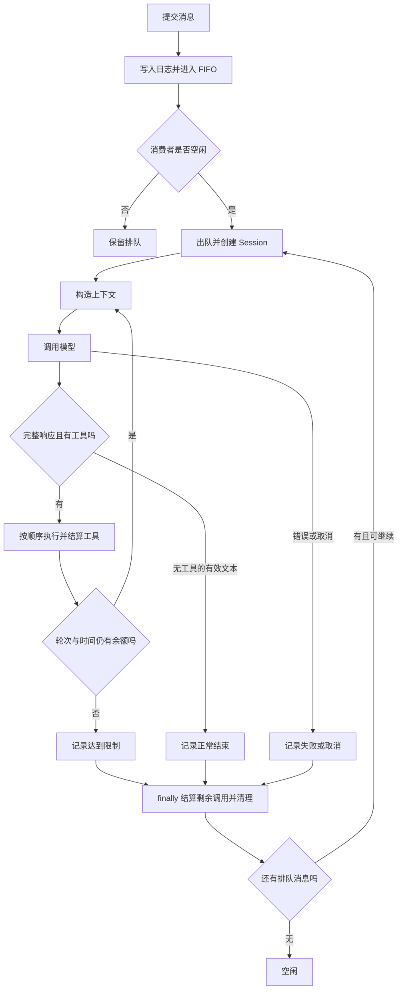
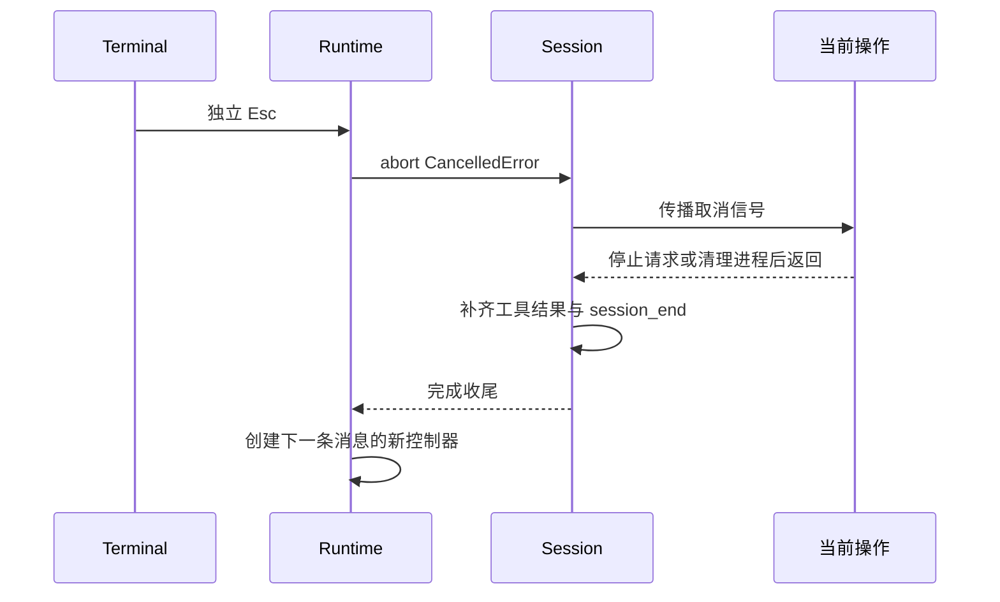

# 04 执行循环：有起点，也必须有收尾

## 两个循环，各管一件事

Runtime 消费用户消息，Agent 在一条消息内消费模型提出的工具请求。把两者写成一个混合循环，容易让新输入突然进入当前模型请求，或让取消误伤下一条任务。



## 入队也要串行化

用户连续按 Enter 时，多个异步日志写入可能交错。Runtime 用 `admission` Promise 链把“检查容量 → 写入 message_queued → 放入队列”串行化。先记录接收，再允许执行，避免工具已经运行却找不到它对应哪条消息。

单消费者是当前实现的核心简化。[队列源码节选](../../src/runtime/queue.ts)：

```typescript
private async pump(): Promise<void> {
  while (this.queue.length && !this.stopping) {
    const item = this.queue.shift()!;
    this.onQueue(this.queue.length);
    this.controller = new AbortController();
    try {
      await this.store.append('message_dequeued', { queueSeq: item.seq }, { messageId: item.id });
      await this.agent.run(item, this.controller);
    } finally { this.controller = undefined; }
  }
}
```

关键在 `await this.agent.run`：它等待整个 Session 的 `finally` 完成。FIFO 保证执行顺序，不保证排队消息永远都会执行；用户退出或发生致命错误时，剩余消息会作为未执行处理。

## 从最小模型循环开始理解

下面是教学骨架，省略了错误分类、日志和协议收尾，不能直接替代生产代码：

```typescript
for (let round = 1; round <= maxRounds; round++) {
  check(signal);
  const input = await context.build(plan, signal, event);
  const response = await requests.call(input, signal, event);
  if (response.status !== 'completed') throw new Error('响应不完整');
  if (!response.toolCalls.length) return response.text;
  for (const call of response.toolCalls) {
    const result = await executor.execute(call, event, blockId, signal);
    // 将 call 对应的 result 放入同一轮上下文块。
  }
}
```

真实 [Agent 实现](../../src/runtime/agent.ts) 还必须保证：空响应报错、已完成工具结果被记录、最后一轮的工具批次被结算、取消时剩余调用被标记，而不是在异常处直接丢弃。

## Esc 是一条取消链



只用 `Promise.race` 提前返回，不会自动停止底层命令。取消信号必须传到模型请求、审批、退避等待和工具；shell 还要终止受管进程组。网络取消也不承诺服务端停止计算或不计费。

[取消源码节选](../../src/runtime/queue.ts)：

```typescript
cancel(): void {
  if (this.controller && !this.controller.signal.aborted) {
    this.ui.status('正在取消当前请求并清理工具…');
    this.controller.abort(new CancelledError('用户按 Esc 取消了当前请求'));
  }
}
```

已经取消的控制器不会再次取消。清理期间重复按 Esc 仍然面对旧控制器；下一条消息只有在收尾结束后才得到新控制器。取消不回滚已发生的文件修改。

## 收尾必须诚实

如果模型一次给出三个调用，第二个中断，第三个不能凭空消失。程序对未开始的调用返回 `not_executed`；已进入处理但结果无法确认的调用返回 `unknown`，并提示检查实际状态，不自动重试副作用。

Session 的结果是 `completed`、`cancelled`、`failed` 或 `limit_reached`。其中 completed 表示循环正常得到最终文本，不是领域任务正确性的证明。鉴权失败、日志不可写、进程组无法清理等 FatalError 则影响整个队列，不能像普通工具错误那样让模型随便继续。

## 小练习

让 FakeModel 的第一次调用一直等待取消，立刻提交第二条消息，然后取消。观察日志应先出现第一条 `session_end: cancelled`，再出现第二条 `session_start`。如果顺序倒过来，说明你只是停止等待，没有正确组织收尾。

下一章：[模型适配与协议](05-模型适配与协议.md)。
