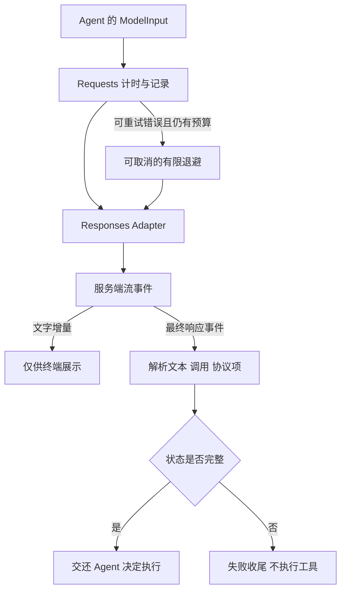

# 05 模型适配：文本展示与工具执行分开

## 为什么需要适配层

执行循环需要知道“本次有没有完整结束、有哪些工具调用、下一轮要保留哪些协议项”。它不需要知道 SDK 的流事件名称和错误对象结构。ModelAdapter 把这两类关注点分开，Requests 再负责超时、重试和记录。



## 统一输出不能只剩文本

[模型输出类型源码节选](../../src/model/types.ts)：

```typescript
export interface ModelOutput {
  status: 'completed' | 'incomplete' | 'failed';
  text: string;
  toolCalls: ToolCall[];
  protocolItems: ProtocolItem[];
  usage?: { inputTokens: number; outputTokens: number };
  reason?: string;
}
```

`text` 用于展示，`toolCalls` 用于执行，`protocolItems` 用于下一轮协议连续性。这三种用途不应通过重新解析一段显示文字来实现。当前适配器保留消息、函数调用与 reasoning 项；遇到不支持的协议项会报错，避免悄悄丢信息。

## 流式输出只改善等待体验

在参数尚未生成完、传输可能中断时执行命令，会制造无法重放的半次行动。[适配器源码节选](../../src/model/openai-responses.ts)：

```typescript
for await (const event of stream) {
  check(signal);
  if (event.type === 'response.output_text.delta' || event.type === 'response.refusal.delta')
    onText?.(event.delta);
  if (event.type === 'response.completed' || event.type === 'response.incomplete' || event.type === 'response.failed')
    response = event.response;
  if (event.type === 'error')
    throw new ProviderError(event.message, undefined, event.code ?? undefined);
}
```

拿到最终对象后，Agent 仍会检查 `status === 'completed'`。不能把“已经显示了文字”或“已经收到一个函数名”当成执行许可。

## 调用与结果必须配对

每个 `function_call` 带 `call_id`，对应的 `function_call_output` 必须使用同一 ID。删掉调用、只保留结果，或者取消时漏掉一个结果，都可能破坏下一轮输入。

[协议校验源码节选](../../src/model/types.ts)：

```typescript
} else if (item.type === 'function_call_output') {
  if (!calls.delete(item.call_id))
    throw new Error('协议中存在孤立或重复的工具结果');
}
// 遍历结束之后：
if (calls.size) throw new Error('协议中工具调用尚未结算');
```

完整函数还检查重复或无效调用 ID。这个校验是协议结构检查，不负责证明工具输出是真实的，也不是服务端所有协议规则的完整替代。

## 无状态请求与重试的取舍

当前 Responses 请求使用 `store: false`，由本地每轮提供完整上下文投影，并请求保留加密 reasoning 内容。这样上下文生命周期由 Harness 管理，减少对远端会话状态的依赖；代价是每轮需要重新构造并发送输入。`store: false` 是请求参数，不应被解释为服务商所有日志与数据保留行为的保证。

SDK 自动重试设为 0，重试统一交给 Requests：瞬时错误和单次超时可有限重试；鉴权失败升级为致命错误；上下文溢出交给上下文修复；压缩请求不在 Requests 内自动重试。默认最多 2 次重试，即首次尝试加两次重试，仍属于一个逻辑 Round。

工具副作用没有跟随网络请求一起重放。只有完整响应进入执行层，才开始工具动作。即使如此，网络超时重试仍可能造成额外服务端计算成本，这与文件是否重复写入是两个问题。

## 小练习

构造一个 `incomplete` 响应，里面同时带有 write 调用。验收条件是目标文件不存在、没有 `tool_started`，Session 正确记录失败。再构造一组缺少输出的 call，确认在下一次模型请求前被拒绝。

下一章：[工具系统与文件操作](06-工具系统与文件操作.md)。
