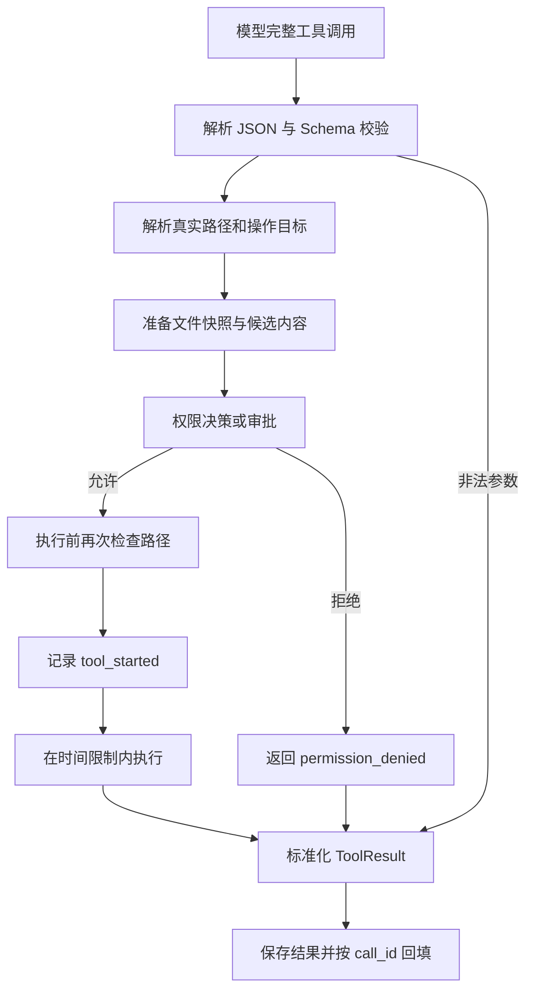
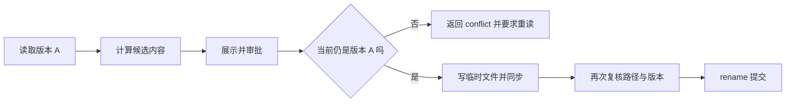

# 06 工具：把动作设计成可检查的契约

## 工具不是把任意函数暴露出去

一个工具至少需要名称、参数结构、用途说明、权限语义、执行实现、结果格式和错误语义。Tiness 将这些收束到固定的五个工具，不增加动态注册系统。

| 工具 | 用途 | 本版限制 |
|---|---|---|
| read | 按行读取工作区文本，或按字节读取登记产物 | 有页长、输出大小和路径限制 |
| write | 创建或完整覆盖文本文件 | 有大小上限、审批和版本复核 |
| edit | 替换唯一匹配文本 | oldText 必须恰好出现一次 |
| shell | 执行非交互命令 | 显式权限、时限、进程清理，无沙箱 |
| update_plan | 替换当前 Session 的结构化计划 | 步骤数、ID 和进行中状态校验 |



update_plan 是一个特殊分支：校验结构后更新内存和日志，不经过文件修改审批。不要因为它也叫工具，就把所有工具机械地套上同一种操作流程。

## Schema 同时服务模型与本地校验

[工具定义源码节选](../../src/tools/schemas.ts)：

```typescript
edit: {
  description: 'Replace exactly one occurrence of oldText in a workspace file. Re-read if the file changed. Requires permission.',
  parameters: object({
    path: Type.String({ minLength: 1 }),
    oldText: Type.String({ minLength: 1 }),
    newText: Type.String()
  })
},
```

`object` 设置 `additionalProperties: false`；定义发送给模型时开启 strict，同时本地使用 `Value.Check` 再校验。模型端约束不能替代程序端检查。

read 的文件行读取和产物字节读取互斥。当前 Schema 用显式 null 表示未使用字段，然后执行层再检查组合是否合法。这说明 Schema 能限制形状，但业务约束仍需代码表达。

## edit 为什么要求唯一匹配

[执行器源码节选](../../src/tools/registry.ts)：

```typescript
const first = before.content.indexOf(args.oldText);
if (first < 0 || before.content.indexOf(args.oldText, first + 1) >= 0)
  throw new ToolError('match_error', 'oldText 必须恰好匹配一次');
next = before.content.slice(0, first)
  + args.newText
  + before.content.slice(first + args.oldText.length);
```

重复内容出现两次时，程序无法知道用户批准的是哪一处。要求模型补充上下文，比默默替换第一处更容易检验。取舍是修改能力较窄，但失败原因明确；本版不实现 AST 修改器和复杂补丁语言。

## 审批与提交之间还有时间差

用户看完修改建议之前，编辑器或另一个进程可能已经改了文件。因此 write/edit 先读取内容快照，用 SHA-256 绑定已展示版本；提交前重新比较路径和版本，再写同目录临时文件并 rename。



[提交源码节选](../../src/tools/paths.ts)：

```typescript
const current = await snapshot(expectedPath, maxBytes);
if (current.hash !== before.hash)
  throw new ToolError('conflict', '审批后文件已变化，请重新读取并申请修改');
```

完整实现还会在临时文件写完后再次检查。原子替换减少半文件状态，但这里没有文件系统事务或锁，不能宣称消除了恶意并发修改的所有竞争窗口。

## 读取结果必须给下一步入口

read 除了正文，还返回行范围、EOF 或下次 offset。单行过长时转为有限产物片段，给出 artifactId 供分页读取。模型无需猜测“是不是还有一半没看到”。

工具结果统一为 `content`，以及可选的 `isError`、`code`、`truncated`、`artifactId`。普通参数或文件冲突返回工具错误，让模型有机会修正；日志等基础设施致命错误则向上抛出，不能包装成可忽略的工具提示。

## 小练习

在临时文件中放两段完全相同的文本，让 edit 替换其中一段。预期返回 match_error，文件保持原样。然后把 oldText 扩大到唯一上下文，再修改成功。再在审批回调中修改原文件，预期冲突且不覆盖新内容。

下一章：[权限、审批与 shell](07-权限审批与Shell.md)。
