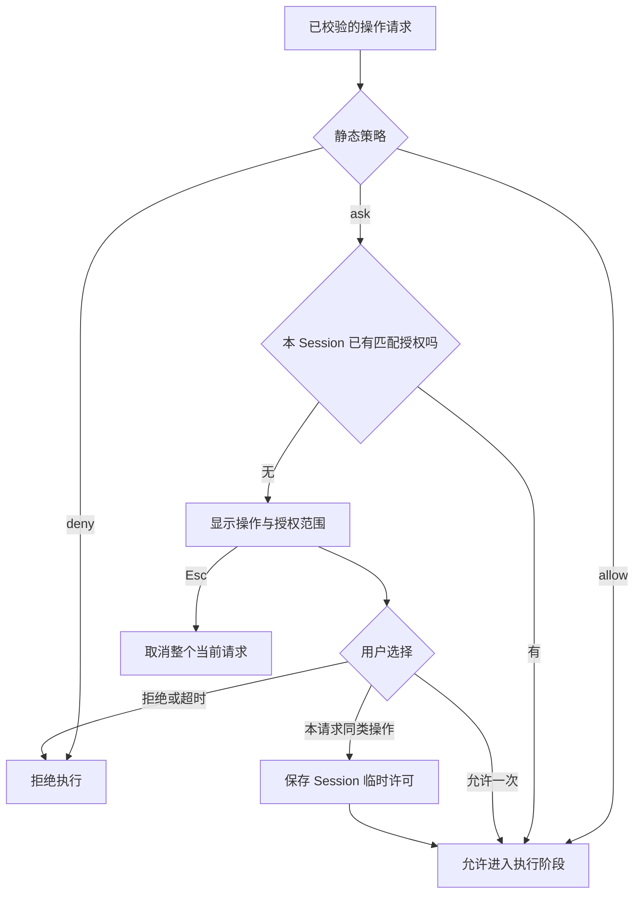
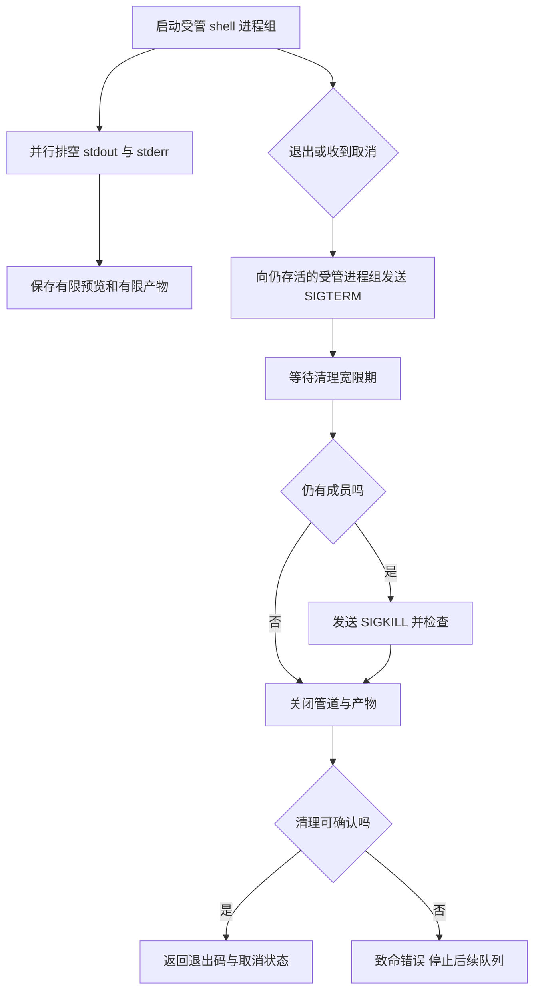

# 07 权限与 shell：批准的是具体能力

## 把三个概念分开

权限策略决定某类操作是 allow、ask 还是 deny；审批是在 ask 时由用户作一次选择；沙箱则是在操作系统或运行环境层限制动作能触及的资源。Tiness 有前两者，没有 shell 沙箱。

这意味着即使 read 只能读取工作区，获准的 shell 仍可能读取宿主用户可访问的其他位置。不能拿文件工具的路径校验来解释 shell 的隔离范围。



## 临时授权放在哪个生命周期里

每次 Agent.run 都新建 Permissions，因此临时许可不会跨 Session。文件操作的同类许可按操作类型与目录及子目录匹配；shell 的同类许可覆盖当前 Session 的所有 shell 命令。它不是“只允许当前这一条命令重复运行”。

[权限源码节选](../../src/permissions.ts)：

```typescript
const directory = request.operation === 'shell' ? '*' : dirname(request.target);
const scope = request.operation === 'shell'
  ? '本 Session 的所有 shell 命令，使用宿主用户权限（无沙箱）'
  : `本 Session 的 ${request.operation} 操作：${directory} 及子目录`;
if (choice === 'session')
  this.grants.push({ operation: request.operation, directory });
```

这是为了减少一项任务内的重复确认而作出的明确放宽。界面必须让用户能查看这个范围；静态 deny 没有“临时绕过”选项。

审批有自己的等待时限，同时受 Session 总时限限制。用户选择拒绝只拒绝该次调用，模型可能继续解释或调整方案；Esc 则取消整个当前 Session。两者不能共用一个模糊的“停止”状态。

## shell 执行为什么比 spawn 更复杂

[命令启动源码节选](../../src/tools/shell.ts)：

```typescript
const child = spawn('/bin/bash', ['-c', command], {
  cwd, env, detached: true,
  stdio: ['ignore', 'pipe', 'pipe']
});
```

cwd 固定在工作区，stdin 关闭，使命令不能抢走用户正在输入的消息。stdout/stderr 持续读取，避免缓冲区填满导致子进程阻塞。`detached: true` 为受管进程组清理提供基础，并不代表允许后台任务永久运行。



主 shell 退出也不代表子进程都退出。实现会处理仍留在受管组内的进程，并确认管道关闭。否则下一条任务开始时，上一条仍可能写文件。

## 大输出需要两个独立上限

工具结果预览限制模型输入大小；产物限制磁盘占用。到达产物上限后仍须读取并丢弃超量数据，不能停止排空管道。结果里应同时说明退出码、取消、截断和产物引用。

已知模型密钥从 shell 环境中移除，产物和日志也做已知值脱敏。但这不是通用秘密识别器，更不是隔离机制。当前设计还没有阻止恶意进程脱离受管组的完整能力，因此适合明确授权的本地任务，不应包装成不可信代码执行平台。

## 小练习

分别测试“拒绝 shell”“允许 shell 后 Esc”“命令输出超过预览上限”。检查无许可时没有 tool_started；取消后队列接续前完成受管进程清理；长输出带有产物引用并没有让程序卡住。所有命令只在临时练习目录运行。

下一章：[上下文管理](08-上下文管理.md)。
