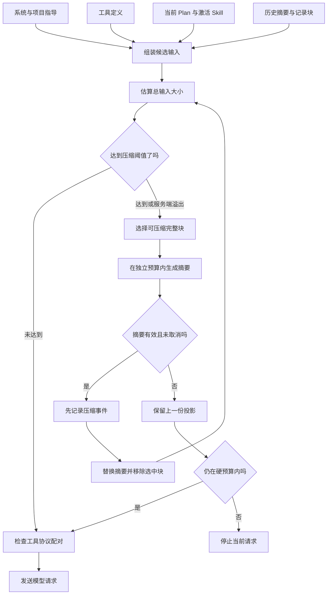

# 08 上下文：压缩记录，而不是丢掉任务

## 上下文不是把聊天记录全部拼起来

每轮模型输入至少包含系统指导、项目指导、工具定义、当前请求、历史、计划和激活的 Skill。只数用户消息长度，会漏掉大量固定成本。只保留最后 N 条，又可能切断工具调用与结果，或者删掉仍未完成的目标。

Tiness 将上下文拆成固定指导、结构化状态、历史摘要和完整记录块。JSONL 保存发生过的事件；ContextBuilder 保存为下一轮模型调用挑选的投影。



## 先扣除不能用于输入的空间

可用输入预算：

```text
effectiveBudget = windowTokens - maxOutputTokens - safetyMarginTokens
默认：32768 - 8192 - 2048 = 22528
触发压缩：约 22528 × 0.8 = 18022
目标大小：约 22528 × 0.6 = 13517
```

触发线低于硬上限，给整理过程留余地；目标线又低于触发线，避免刚压缩完就再压缩。输入计数包含 instructions、input 和 tools，并额外预留协议开销。

[预算源码节选](../../src/context/budget.ts)：

```typescript
count(value: unknown): number {
  const text = typeof value === 'string' ? value : JSON.stringify(value);
  if (!this.encoder) return Buffer.byteLength(text);
  return Math.ceil(this.encoder.encode(text, [], []).length * 1.1) + 32;
}
```

匹配到 tokenizer 时仍加余量；未知模型采用 UTF-8 字节数作为保守估计策略。这不是所有服务端 token 计算方式的数学保证，所以服务端仍可能返回上下文溢出。

## 以完整 Round 为压缩单位

[上下文块源码节选](../../src/context/builder.ts)：

```typescript
export interface Block {
  id: string;
  items: ProtocolItem[];
  kind: 'request' | 'round' | 'status';
  sessionId: string;
}
```

同一 Round 的模型协议项与工具结果属于同一个 block。压缩整个块，可以避免只剩 function_call_output 却找不到 function_call。

当前用户请求不会被选中压缩。默认优先保留最近两轮；如果没有其他候选而输入仍超硬预算，最近轮次也可能成为候选。因此“最近两轮优先保留”是偏好，“当前请求不压缩”才是本算法的硬选择。

当前 Plan 是单独的结构化状态，每轮重新放入指导。摘要要保留目标、约束、已完成改动、工具和测试证据、失败、拒绝、取消、未完成事项及文件引用。历史观察明确标记为可能过期，修改前应重新读取。

## 摘要请求自己也可能超限

不能把一个已经太长的历史，原封不动交给“请总结”。选候选块时，程序逐块试装摘要输入，计入旧摘要和摘要指导，直到达到摘要请求的输入预算。若连一个完整块都放不下，不能靠无限重试解决，最终应保留记录并结束超限请求。

每个 Session 默认最多四次压缩，单次默认 60 秒；当前请求过大、静态指导过大或摘要持续失败，都会使任务不能继续。可靠的上下文管理不是“保证永不超限”，而是超限时不会破坏原始事实。

## 摘要有效后再提交新投影

[压缩提交源码节选](../../src/context/builder.ts)：

```typescript
await this.store.append('context_compacted', {
  summary: response.text,
  blockIds: selected.map(b => b.id),
  compaction: this.compactions
}, event);
const ids = new Set(selected.map(b => b.id));
this.summary = response.text;
this.blocks = this.blocks.filter(b => !ids.has(b.id));
```

此前已经检查 completed、没有工具调用、非空、可见摘要大小和取消状态。先验证并记录，后替换内存。失败时记录 `context_compaction_failed`，保留旧投影。摘要本身可能有语义遗漏，结构校验不能证明它准确无误；当前请求、计划、近期原始证据和重读规则共同降低这个风险。

## 真实测试暴露的一次预算错误

本项目最初把 `summaryMaxTokens` 直接用作摘要请求的总输出预算。真实测试中，推理开销耗尽预算，响应以 incomplete 结束，没有可见摘要。

修复后，摘要生成使用 `maxOutputTokens`，可见摘要保留长度另用 `summaryMaxTokens` 检查。一个限制服务于“允许模型生成多少”，另一个服务于“允许历史摘要占据多少上下文”。这次修复说明，同样叫输出长度的数字，也可能属于不同资源。

服务端仍报告溢出时，当前实现将有效输入预算乘以 0.85，触发有限修复。重试轮数有上限，不循环加大配置，也不会无条件删除全部历史。

## 小练习

构造十个带成对工具结果的旧 block，再加入当前用户目标。降低预算触发压缩。验证三件事：当前目标保留、协议配对仍合法、原 JSONL 未被删改。随后让摘要模型返回空文本，检查原投影保留；若仍超硬预算，应停止而不是发送非法输入。

下一章：[Plan 与任务进度](09-Plan与任务进度.md)。
