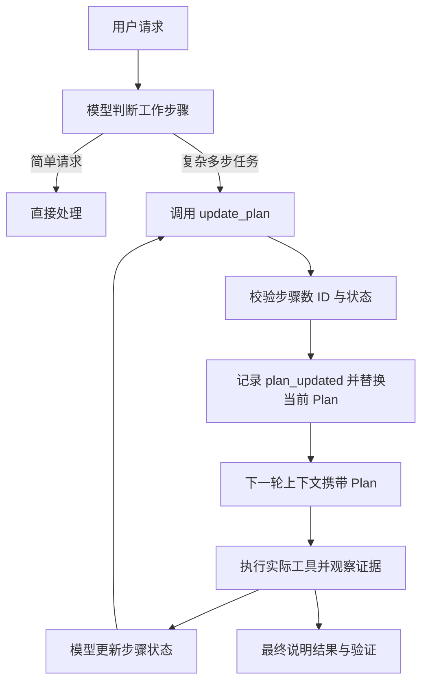

# 09 Plan：保留可见的工作结构

## 什么时候值得列计划

解释一句错误信息，不需要先建立三步计划。排查原因、修改源码、运行测试、处理回归，则需要让目标和进展可见。Tiness 的系统指导要求复杂多步工作在实质修改前使用 update_plan，简单请求可以直接回答。

这里有一个必须说明的边界：当前代码没有复杂任务分类器，也没有“所有修改前必须存在 Plan”的硬闸门。是否复杂由模型按指导判断；程序强制的是计划的形状与状态约束。教材不能把提示中的要求写成确定性的拦截能力。



## 结构小，但信息要足够

[计划类型源码节选](../../src/tools/types.ts)：

```typescript
export interface Step {
  id: string;
  text: string;
  status: 'pending' | 'in_progress' | 'completed' | 'blocked';
}
export interface Plan { explanation: string; steps: Step[] }
```

稳定 ID 用于表达同一步，text 用于人阅读，status 用于显示当前工作。explanation 解释调整原因，例如“测试定位到边界条件，增加回归验证”。本版不建立依赖图、任务分配器、子代理或跨 Session 计划库。

## 为什么提交完整计划

update_plan 接收新计划全量替换，而不是“把第 3 项改成完成”这样的增量指令。完整替换更容易校验，也能避免序号变化时修改错步骤。代价是每次调用略多一些 token，但当前最多十步，成本受控。

[计划校验源码节选](../../src/plan.ts)：

```typescript
if (!plan.steps.length || plan.steps.length > maxSteps)
  throw new ToolError('invalid_plan', `计划需要 1–${maxSteps} 个步骤`);
if (new Set(plan.steps.map(s => s.id)).size !== plan.steps.length)
  throw new ToolError('invalid_plan', '步骤 ID 必须唯一');
if (plan.steps.filter(s => s.status === 'in_progress').length > 1)
  throw new ToolError('invalid_plan', '只能有一个进行中的步骤');
```

零个进行中步骤是合法的，例如全部完成或全部待开始。单消费者只做一条工作主线，因此限制最多一个进行中步骤，减少“什么都在做”的假进度。

## 状态不是证据

模型可以把“运行测试”标为 completed，但这只是计划声明。实际 `shell` 调用、退出码和输出才是验证证据。即使 shell exit=0，也只证明该命令的退出状态，不能证明测试覆盖了全部需求。

计划保存在当前 Session 的内存和 JSONL 中，进入模型上下文，并在终端消息流中更新。新 Session 开始时计划重置，避免上一条请求的步骤混进下一条任务。

## 小练习

构造重复步骤 ID、两个 in_progress、全部 pending 三种计划。预期前两种拒绝，第三种通过。然后审阅一份“所有步骤 completed，但没有测试工具结果”的记录，写出正确的验收结论：计划宣称完成，缺少对应验证证据。

下一章：[项目指令与 Skills](10-项目指令与Skills.md)。
