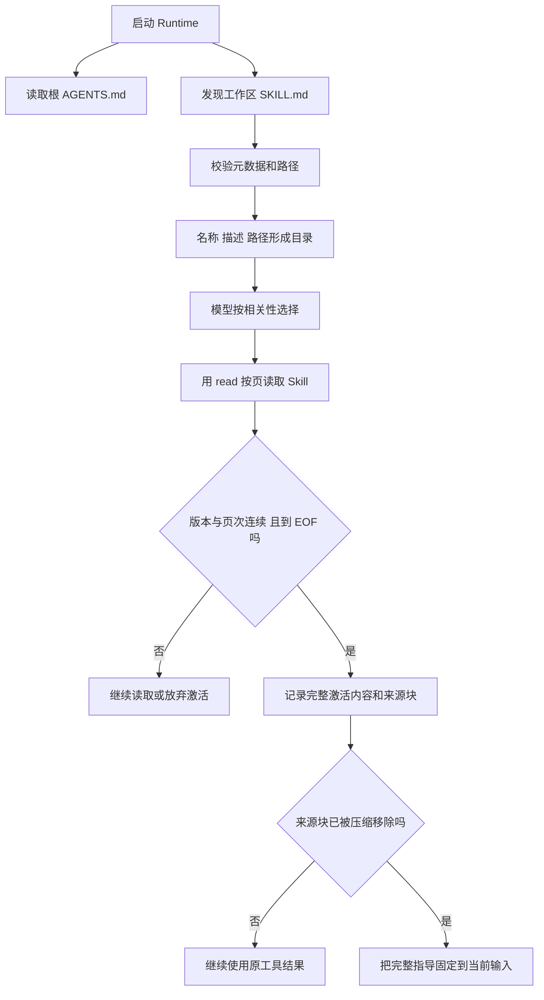

# 10 项目指导与 Skills：按需读入知识

## 为什么没有 extension，仍然可以有 Skill

本版没有动态扩展注册、插件生命周期和跨任务 memory。当前已经实现的 Skill 是工作区内的指导文件：告诉模型如何使用现有工具完成某种工作，不给进程注册新的执行能力。

AGENTS.md 保存项目通用指导；`.agents/skills/<name>/SKILL.md` 保存某项工作的方法。这个目录和加载行为是 Tiness 的实现约定，本章不把它推广成所有平台必须遵循的路径。



## 发现元数据，不等于全部注入

启动时发现器为解析和校验会读取文件，但发给模型的目录仅包含 name、description、path。模型使用 read 获取正文后才参与激活。这里区分的是模型上下文加载量，不是宣称磁盘从未读取正文。

当前校验名称与文件夹一致、description 非空、长度受限，并检查部分可选元数据。项目使用有限 YAML 解析配置；这不是完整标准认证工具。启动后没有热重扫目录，新加入的 Skill 通常需重启进程才能被发现。

[Skill 类型源码节选](../../src/skills.ts)：

```typescript
export interface Skill {
  name: string;
  description: string;
  path: string;
}
```

保持目录小，是为了让模型能发现能力，同时避免每个 Skill 的完整正文抢占固定输入预算。

## 为什么要追踪分页和来源块

Skill 可能超过一次读取页长。只读第一页就宣布激活，会让后半部分约束丢失。ActiveSkills 检查页次连续和文件版本标识一致，只有到 EOF 才保存完整激活文本。

[激活源码节选](../../src/skills.ts)：

```typescript
if (!part || part.hash !== slice.hash || part.next !== slice.offset) {
  this.parts.delete(path);
  this.active.delete(path);
  return;
}
part.text += slice.text;
part.next = slice.end + 1;
```

这里 read 返回的 `hash` 实际是文件大小和修改时间组合，不是 edit 快照中的 SHA-256。它用于检测分页读取期间常见的文件变化，不应混称为密码学内容校验。

完整正文已经存在于保留的工具结果中时，不需要再重复注入。只有任一来源块离开上下文，才把完整 Skill 正文固定到指导区，防止压缩丢掉工作步骤。激活状态按 Session 创建，不提供跨任务记忆；固定内容本身也占预算，过多指导仍可能造成超限。

## 指导文件不能提升权限

Skill 中写“直接运行所有命令”不会覆盖 `shell=ask`。AGENTS.md 中写“允许修改任意文件”不会改变 Paths 的原生工具边界。模型仍要通过已有工具，接受相同的参数、权限和执行限制。

文件内容和摘要可能包含不可信指令。系统指导要求将它们作为有来源的内容处理，这有助于行为约束，但不是对所有提示注入的硬防御。

## 小练习

建立一个只说明“读取 fixture → 修改目标文件 → 运行测试”的小 Skill。分别读取第一页、连续读到 EOF、跨版本读取两页，检查激活状态。再将静态 write 权限设为 deny，确认 Skill 的文字不能使写入放行。

下一章：[JSONL 与工具产物](11-JSONL与工具产物.md)。
