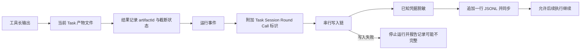

# 11 记录：先留下事实，再做阅读投影

## 为什么第一版用 JSONL

用户需要知道本次任务发生了什么，但本版不做旧会话检索、恢复和统计平台。一个事件一行的 JSONL 易于追加、直接检查，也能关联请求、轮次与工具。数据库会带来查询、迁移、恢复等新责任，当前需求不足以支持这些成本。



## 日志不是展示文字的副本

一个事件包含 version、seq、time、taskId、type，并可附带 sessionId、round、messageId、callId。比如 `tool_started` 表示进入执行处理，`tool_result` 表示结算结果。这比一行“正在运行……”能支持更准确的判断。

[写入源码节选](../../src/storage/task-jsonl.ts)：

```typescript
const write = this.tail.then(async () => {
  if (this.failed || this.closed)
    throw new FatalError('Task 日志不可写，已停止执行');
  try {
    await this.handle.writeFile(redact(JSON.stringify(event), this.secrets) + '\n');
    await this.handle.sync();
  } catch {
    this.failed = true;
    throw new FatalError('Task 日志写入失败，已停止执行；记录可能不完整');
  }
});
```

Promise 链维护写入次序，每次同步提高故障后可追溯性，代价是更多磁盘操作。这里没有承诺断电事务或恰好一次执行：进程在文件改动后、结果日志写入前退出，仍可能留下结果不确定的窗口。

## 工具产物承接大内容

工具长输出若全部塞进 JSONL、上下文和终端，会同时放大磁盘与阅读成本。Artifacts 为当前 Task 登记有限文本文件，结果返回 ID；read 根据 ID 分页，而不是允许模型直接浏览 `.tiness` 私有目录。

[产物读取源码节选](../../src/storage/artifacts.ts)：

```typescript
const path = this.ids.get(id);
if (!path)
  throw new ToolError('invalid_artifact', '只可读取当前 Task 已登记的产物 ID');
if ((await lstat(path)).isSymbolicLink() || await realpath(path) !== path)
  throw new ToolError('invalid_artifact', '产物路径已发生变化');
```

ID 映射属于当前 Task 内存。重启后不自动恢复登记，不提供旧产物工具检索。用户仍可自己从磁盘阅读历史文件。

“产物”也不一定代表完整原始输出：默认单个最多 10 MiB，超出后标记截断。分页偏移必须按返回的 `nextByteOffset` 继续，避免把 UTF-8 多字节字符从中间切开。

## 脱敏也有精确边界

JSONL、终端和产物会替换已知凭据值。产物流式写入还保留跨 chunk 的短尾巴，处理一个密钥被拆成两段输出的情况。只替换每个独立 chunk，可能漏掉这种边界。

已知值脱敏不是扫描任意业务秘密。用户请求、文件内容和命令结果可能仍包含敏感信息。日志用于本地追溯，不应在未经审阅时当作可公开的教材样本。教学样本使用合成文本和临时工作区。

## 小练习

从一次练习日志中只选同一个 callId，检查是否经历 permission_decision、tool_started、tool_result。对拒绝操作，允许缺少 tool_started；对执行过但结果未知的操作，不能自行推断“肯定没有副作用”。写出它与“明确未执行”的区别。

下一章：[终端交互](12-终端交互.md)。
