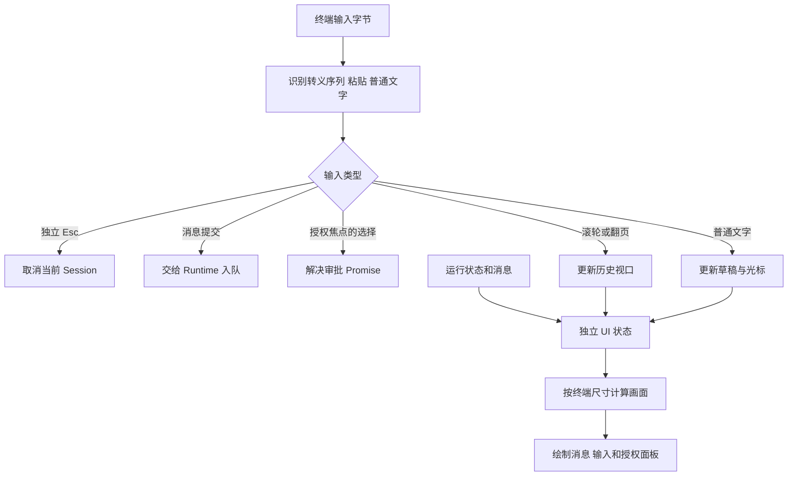

# 12 终端：让控制权在界面中可见

## 能执行还不等于能使用

早期界面把工具全文、计划、状态和审批堆在一起，用户很难区分消息与操作，也难以翻阅旧内容。后来把顶部状态、中间消息流、底部输入和居中授权面板分开。这个改动并没有增加 Agent 能力，却直接改善了可操作性。

终端 UI 的职责是表达运行事实、收集用户意图，不自行运行工具。用户点击“允许”，只会解决一个审批 Promise，真正的动作仍由 ToolExecutor 在再次校验后执行。



## 先设计状态，再画边框

草稿、光标、当前焦点、授权选项、消息历史、视口位置和正在流式生成的内容都单独保存。否则一次重绘可能清空输入，或新消息把用户正在看的历史推走。

[终端状态源码节选](../../src/terminal.ts)：

```typescript
private viewportTop: number | null = null;
private unread = 0;
private focus: 'input' | 'approval' = 'input';
private selected = 2;
```

`viewportTop=null` 表示跟随最新输出，数值表示正在查看某个历史位置。selected=2 对应第三个选项“拒绝”。用显式状态表达，比根据当前屏幕上有什么文字猜测行为更可靠。

## 授权不能吞掉正在输入的内容

授权出现时，如果没有草稿，自动聚焦面板；已有草稿则保留输入焦点。用户可用 Tab 切换。授权焦点下方向键或 1/2/3 选择，Enter 确认，鼠标可直接点击选项。普通文字或粘贴会切回输入区；数字 1/2/3 在授权焦点下仍是选择键，数字开头的新消息可先按 Tab。

[授权初始化源码节选](../../src/terminal.ts)：

```typescript
this.focus = this.draft ? 'input' : 'approval';
this.selected = 2;
this.approvalDetails = false;
this.detailTop = 0;
```

这将“输入新消息”和“同意工具动作”分成明确的意图。F2 展示完整操作和授权范围；面板默认预览不能代替详细内容。小于 40 列 × 16 行时提示扩窗，并阻止审批确认，避免用户在看不全选项时误操作。

## 全屏终端要自己实现历史翻阅

当前界面使用备用屏幕缓冲区，不能假定操作系统终端的原生滚动历史就是应用消息历史。因此保存进程内消息，并处理鼠标滚轮、方向键、PgUp/PgDn、Home/End。用户查看旧消息时保持视口，显示新消息数量，End 回到最新；有草稿时 Home/End 用于输入光标，Ctrl+Home/End 可以直接跳历史。

工具输出默认折叠，F2 展开；Plan 在消息流中更新，底部只保留输入和提示。进程内历史不按固定 5000 行删除，但这也意味着长时间运行仍会累积内存和布局成本。本版没有虚拟化历史或旧 Task 浏览器。

## 中文、粘贴和 Esc 都不能按一个字符处理

中文显示宽度常为两列，组合字符和 emoji 也不能简单用字符串 length 计算。实现使用 grapheme 分段和 string-width 换行。bracketed paste 将多行粘贴视为一份草稿，只有明确 Enter 才提交。

方向键本身以 Esc 字节开头。解析器先识别完整转义序列，再以短等待区分独立 Esc，避免按方向键时误取消任务。鼠标点击和滚轮也通过转义序列传入，不是普通消息文本。

模型和工具输出可能含终端控制序列，因此输出先经 `plain` 清理，防止内容移动光标、伪造审批布局。实际 PTY 检查还发现过“面板覆盖中文宽字符时残留背景”的显示问题：最终绘制面板所在行时先清空底层内容。

## 怎样验证 UI

直接调用 key 方法只能证明按键分支，不证明用户看到了完整选项。布局测试检查不同尺寸、中文列宽、面板不覆盖输入；PTY 测试启动真实终端进程，完成授权、长命令、Esc 和 FIFO；再解释实际控制序列检查可见画面及滚轮效果。

## 小练习

先输入半句草稿，再触发授权。检查草稿仍在、Enter 只提交消息；Tab 后选择拒绝。再滚动到历史上方，让模型追加消息，观察视图保持位置。最后在窄窗口测试三个授权选项是否都能看到。

下一章：[从骨架到验收](13-从骨架到验收.md)。
