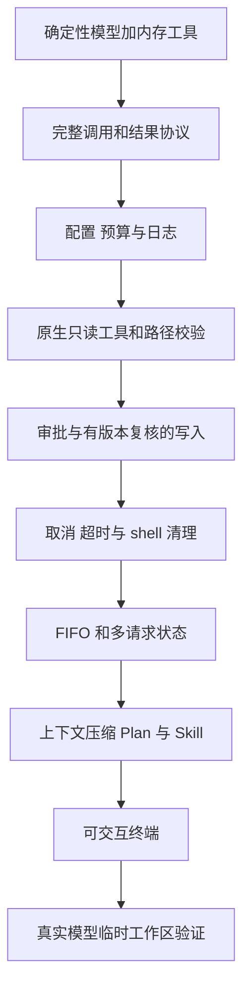

# 13 从零动手：逐步增加责任，再验证边界

## 先完成一个可观察的小闭环

从零开发时，不必第一天就实现完整终端。先用确定性模型替身，让输入、工具请求、结果回填和终止条件全部可观察。真实模型会增加生成的不确定性，不适合拿来掩盖执行循环的问题。

本教材附有可直接运行的 [01-mini-loop.ts](examples/01-mini-loop.ts)。它仅读取内存里的示例文字，不访问 API、不读写文件、不使用全局配置。在项目根目录执行：

```bash
bun run 教材/从零开发极简Harness/examples/01-mini-loop.ts
```

预期输出：

```text
Round 1: call
工具观察：Hello Harness
Round 2: answer
我实际读取到：Hello Harness
```

实验的模型替身固定在第一轮请求工具、第二轮根据观察回答，它不具备理解用户任务的能力。教学模型接口也省略了 call_id、reasoning、取消和日志，不能直接拿去运行实际写文件或 shell 操作。

核心循环节选：

```typescript
for (let round = 1; round <= maxRounds; round++) {
  const decision = await model.generate(items);
  console.log(`Round ${round}: ${decision.kind}`);
  if (decision.kind === 'answer') return decision.text;
  const output = await execute(decision.name, decision.args);
  console.log(`工具观察：${output}`);
  items.push({ kind: 'observation', text: output });
}
```

现在把运行参数改为 1：

```bash
bun run 教材/从零开发极简Harness/examples/01-mini-loop.ts 1
```

预期工具读取已经发生，但进程以状态码 1 报告达到轮次上限，没有最终回答。这个实验说明：工具执行成功、Session 正常完成、用户目标完成是三个不同判断。

## 按风险增加组件



这个顺序是学习和实现路径，不是当前程序每次启动都要执行的顺序。可以先用假审批器完成权限测试，再接入真实按键；可以先用 FakeModel 构造超限历史，再调用真实摘要模型。

| 阶段 | 最小可交付行为 | 可以进入下一阶段的证据 |
|---|---|---|
| 闭环 | 一次调用、一次观察、最终回答 | 示例输出顺序正确；轮次 1 时报告未完成 |
| 协议 | 工具调用和结果可配对 | 孤立结果、重复 ID 被拒绝 |
| 资源 | 配置合法、每次运行可追溯 | 负数预算失败；日志 seq 有序 |
| 文件 | 读取和修改有确定边界 | 越界被拒绝；审批后修改冲突不覆盖 |
| 控制 | 权限、超时、中断有效 | 未授权无执行；取消后清理完成 |
| 队列 | 新消息 FIFO 接续 | 第一条收尾早于第二条开始 |
| 上下文 | 预算内构造完整输入 | 压缩失败保留旧投影；当前目标保留 |
| 交互 | 输入、审批和输出可共存 | 实际 PTY 完成授权和 Esc；画面可见 |
| 模型 | 对真实端点形成闭环 | 临时文件结果、工具证据和最终说明一致 |

## 用失败路径设计测试

[运行测试](../../tests/runtime.test.ts) 不只检查回答内容，还检查取消、队列、轮次和执行事件；[工具测试](../../tests/tools.test.ts) 检查版本冲突和进程组清理；[上下文测试](../../tests/context.test.ts) 检查摘要失败不覆盖原投影；[终端测试](../../tests/terminal.test.ts) 与 [PTY 测试](../../tests/terminal-pty.test.ts) 分别检查布局状态和真实交互。

| 故障注入 | 应观察什么 | 不能接受的假通过 |
|---|---|---|
| 模型返回 incomplete 且带 write | 文件未创建，无 tool_started | 屏幕显示过工具名就认为可执行 |
| 用户拒绝 write | 返回权限错误 | 自动换 shell 写入后称为成功 |
| 审批期间修改原文件 | 返回 conflict，保留别人修改 | 只看 write 返回值，没看磁盘 |
| 摘要为空或超长 | 原投影保留，必要时停止 | 摘要字段有值就认为压缩成功 |
| 长命令中 Esc | 受管进程清理后再运行下一条 | 只检查 UI 显示“已取消” |
| 授权出现时已有草稿 | 普通 Enter 只提交消息 | 仅调用审批函数，不看输入焦点 |
| 磁盘日志写入失败 | 停止队列并说明记录不完整 | 命令照常执行，日志错误被吞掉 |

“拒绝后不换工具绕过”当前主要由模型指导表达，静态权限测试只能证明指定工具未执行。如果需要硬性禁止不同工具达到同一效果，就超出了本版的简单策略，需要更强的能力隔离设计。验收时不要把前者冒充后者。

## 运行项目已有检查

在项目根目录、依赖已安装的前提下：

```bash
bun run typecheck
bun test
```

默认本地测试使用替身和临时 fixture，真实 API 场景需要显式启用。仅在连接已正确配置、理解会产生模型调用的情况下运行：

```bash
TINESS_LIVE=1 bun test tests/live.test.ts
```

具体场景和当时结果见 [测试报告](../../TESTING.md)。不要把报告中的历史通过次数当成未来任何修改都自动通过；也不要将默认 skip 描述成失败。

## 一个完整的小项目练习

在独立练习目录放一个计算函数及一个确实失败的测试，让 Tiness 按“读取 → 计划 → 修改 → 验证”完成修复。执行期间提交第二条总结消息，确认它在修复请求结束后才开始。另起一次长命令任务，授权后按 Esc，确认后续请求仍能处理。

交付一份简短记录，包含原始失败证据、实际修改、验证结果、两条 Session 的先后关系，以及取消是否清理完成。无需开发新工具或增加 memory。若模型输出和文件状态不一致，以可检查的实际结果为依据。

## 回到设计判断

当你准备增加新功能时，先写清楚它属于哪个生命周期、读取什么状态、能制造什么副作用、失败如何收尾、怎样验收。若需要同时改动多个组件才能解释一种行为，先检查职责是否混在一起。

Tiness 的可学习之处，是把“模型可以决定下一步”放在一个边界清楚的执行系统里。功能取舍始终围绕同一个问题：这个能力是否帮助当前任务更可靠地完成，还是先引入了本版尚不需要承担的新责任？

返回：[教材目录](README.md)。
